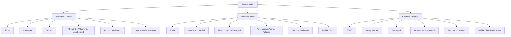

link: [[RMIT#^a00d15]]

---

# Title Page

# Index

# 1. Introduction

This report is carried out for the purpose of providing a first stage of a strategic plan for Intrepid Group Limited and is focused on the tourism industry in which IGL operates its business mainly with the subsidiary Intrepid Travel. This report is going to focus on the analysis of the tourism industry, particularly in Australia, and will provide the understanding as to the economy, the market that comprise of the external environment for the corporation, as well as an analysis of IGL which provides insights of the corporation's strengths and weaknesses, so as to offer competitiveness to further the corporation's business.

The Intrepid Group Limited (IGL) is a public unlisted company that operates its business mainly in the tourism industry, and the corporation mostly generate revenues by selling and organising tours for tourists globally {IBISWorld, 2019 #796}. As one of the global travel agencies, IGL has become the world's largest travel B Corp in 2018 {Intrepid Group Limited, 2021 #798}. However, the tourism industry, on which Australia depends heavily, a has been severely impacted in 2020 by the bushfires and the COVID-19 pandemic. There would be, however, opportunities in this context for IGL to grow its business.

This report would use a wide range of analysis techniques and assessment tools for the corporation and the industry, with trustworthy data that could provide relevant information as to how this growth is achieved, through diagrams, tables etc. This report is in a business format with an introduction to each section of the basic elements of the models used.

# 2. Situation Analysis

There would be analysis made in this chapter about the situation that IGL is facing, assisted by analysis tools, from three different perspectives which are from the 5C analysis framework: Context, Customer, and Company. The context section gives an overview of the industry that the chosen company is in, the customer section gives an analysis of the segmentation of the consumers, and the company section offers an internal analysis of the company and its competitive advantages.

## 2.1 Context

### 2.1.1 Industry Definition

IGL as a corporation in the general tourism industry, operates its business both in Australia and in the world. However, considering the nature of the business conducted by IGL, it could be found that IGL mainly operates in the Travel Agency and Tour Arrangement Services industry {IBISWorld, 2019 #796}. The Australian Travel Agency and Tour Arrangement Services industry, as one of the value chains of the Australian tourism industry, is one that offers information and booking services to local, domestic, as well as global visitors on trips with transport, accommodation, and tourist attractions, and the visitors have different purposes for their travelling {Cloutman, 2021 #862}.

1.xlsx

#### Key Trends
1. The COVID-19 pandemic has been impacting the industry seriously with sharply reducing demand for the services of the industry.
2. It is anticipated that online services would continue to be a growing area in the next five years for the industry.
3. The industry is anticipated to recover and regain momentum from the COVID-19 pandemic in the future.
4. There would be increase in demand if Australia and other countries open their borders and customs.

### 2.1.2 Porter's Five Forces Analysis

Porter's five forces aims to define and investigate five strategic forces that would have impact on the market, and this model can help to position a business in terms of its strengths and weaknesses {Porter, 1996 #642}

2.xlsx

#### Key Findings

1. Because there are more small businesses in the industry, the market concentration of this industry is low, but competition is high and is increasing.
2. Both suppliers and buyers have strong bargaining power.
3. There are some significant barriers to enter in the industry, but the internal competition in the industry has increased the threats of substitutes.

The table above indicates that the competitive rivalry is high in the current Travel Agency and Tour Arrangement Services industry, based on the fact that there are four major players in the industry which leads to the situation that the other companies take up 72.6% of the industry market share {Cloutman, 2021 #862}. However, the industry could prosper again as before the COVID-19 pandemic, so the opportunities would lay in the hands of those who adapt faster to technologies to promote their responsiveness and work efficiency.

The threat of new entrants are currently moderate, since the barriers to entry are high in terms of competition and technology change. The bargaining power of consumers is high, because the industry generates revenues from consumer purchases, but there are not many tourists when the virus is still contained in Australia, in terms of both inbound and outbound trips. Considering that the regulations are decreasing in their power, and the lockdown situations, it would be easier for new entrants to take market share.

The bargaining power of consumers would become more. To deal with the COVID-19 pandemic, the policies are taken to restrict people from travelling, and since the economy is highly dependent on tourism but there is small chance that the economy could revive from the pandemic, people would have less money for travel, and in return consumers would gain more bargaining power.

Suppliers would, on the other hand, have less bargaining power, due to the fact that their revenue are generated from being the source on the supply chain, and logistics would be slow or even stop when there is lockdown. And, if to consider that customer demand is low at present, and there are not much suppliers can do, for instance, incorporating technologies, since they provide spatial products and services, there would not be much chance for them to gain more bargaining power.

The threat from substitutes, is very high at present. The industry has established its generic business model and is easy to imitate, and Australia has a free market, so the chance is the degree of threats from substitutes would be even higher than it is now.

### 2.1.3 PESTLE Analysis

PESTLE stands for the initials of the following six areas when dissecting so as to analysing an industry, and they are: P for Political, E for Economic, S for Social, T for Technological, L for Legal and E for Environmental. For the analysis to be comprehensive, and to be as mutually exclusive and collectively exhaustive as possible, the PESTLE model offers an overview for understanding an industry. And, therefore, this analysis would help IGL to gain deeper understanding of the Travel Agency and Tour Arrangement Services industry.

3.xlsx

#### Political

There is a moderate, and is now decreasing political regulation imposed upon the industry mainly because of the removal of the Travel Compensation Fund (TCF) {Cloutman, 2021 #862}. The TCF was closed in 2015, which was initially design to monitor the performance of the industry in terms of both finance and ethics in order to protect consumers whose rights may have been depreciated or violated by travel agencies' bankruptcy or fraud. However the TCF was closed and thus there has been not any longer the need to report for the companies in the industry, which has subsequently led to the continuing deregulation of the industry {Cloutman, 2021 #862}.

However, there is the Modern Slavery Act 2018 that is to be considered. Tourism and related industries are labour intensive, which means there must be the obligation for companies to report to prove they have been abiding by the Act. Nonetheless, the political influence on the industry is moderate, though not minor.

#### Economic

The economic volatility is medium and moderate. To begin with, the monetary power, or rather, the strength of the Australian dollar would affect very largely consumers' demand for tour services, in a direct manner. This is because that it would be cheaper to travel if the Australian dollar is appreciating which indicates stronger affordability in exchange of foreign currencies, and that leads to demand for travel overseas. While, in fact, the Australian dollar is depreciating. That means the Australian dollar is less affordable for foreign service and may generally have less purchasing power. That means the economic condition is more volatile than before.

#### Social

There is social issues that are related to the industry. The first is the public concern about the COVID-19 pandemic. The pandemic has caused millions of deaths around the world, and though the Australian government has taken immediate actions to mitigate the risk situation, it is still not safe to travel for the majority of people, whether they are Australians or are from the world. That leads to decreased demand for the industry and it is unlikely that this hazardous situation would end soon {Polyzos, 2020 #661}. The second factor is that people's concern about labour issues. This industry is a labour intensive one, and there is no clear boundary as to what accounts for slavery. This leads to decreased resilience and sustainability of the industry.

#### Technological

The technological progress has been continuously seen in the Travel Agency and Tour Arrangement Services industry. This is due to the ever faster development of the Internet and online services, which has led many businesses seeking online presence to attract more consumers. With the technological progress, consumers are more and more accustomed to access booking services and other services alike through online platforms. That has caused the disruption of technology being more and more influential in the industry. And since the level of technology change is high, this factor is going to hugely impact the industry.

#### Legal

The Modern Slavery Act for large businesses was passed in 2018 by the Federal Government in Australia. This has led those companies with over $100 million annual revenue obliged to report on their actions and strategies to mitigate slavery risk in their operations {Cloutman, 2021 #862}.

#### Environmental

The 2019/2020 Australian bushfires raised people's concern on the environment issues and with the COVID-19 pandemic, there is increasing concerns for theories and practices of sustainability, ecological friendly purchasing behaviours. The trend is to go beyond what are visible and instant profit, but to focus on more long-lasting interests of all, in the current industry.

## 2.2 Customer

### 2.2.1 Segmentation Map

4.xlsx

### 2.2.2 Potential Revenue

5.xlsx

**Calculations**

1. Expense on personal discretionary income spent on travel services can be found from databases.
2. Surveys, interviews, questionnaires could be used for our target market to analyse their total and each spending on travel services in Australia and their feedback.

**Sensitivity Analysis**

Sensitivity analysis is a kind of methods that would increase the efficiency of decision making process for decision makers to solve problems with more than solutions, in that it provides various perspectives and ideas into the current issue for considerations about alternatives. For IGL we would use price and service quality as independent variables that would cause the change in value of the independent variables.

## 2.3 Company
### 2.3.1 Company Capabilities

**Porter's Value Chain**

The value chain is the collection of activities undertaken by companies in an industry to produce a valuable commodity, in this case to be travel services, to its target customers.

6.xlsx

### 2.3.2 Brand

A Brand Report Card would enable the marketers to check on a regular basis the strengths and weaknesses of their brands on certain occasions so as to attribute and associate them as well with the success of the brand.

7.xlsx

# 3. SWOT Summary

SWOT analysis is to strategically plan for an individual or organisation to position itself with understanding its strengths, weaknesses, opportunities and threats relevant to competition.

**Strengths**
1. Pricing is less than competitors.
2. There are customisation services.
3. IGL has a wonderful team that is willing to solve problem related to management and customer satisfaction.

**Weaknesses**
1. There are a huge amount of competitors.
2. There is currently not much need for travel services due to the COVID-19 pandemic.
3. The website is not quite attractive.

**Opportunities**
1. Competition in Australia is high.
2. There is chances to boost the performance by promoting online since it is the trend.

**Threats**
1. Online service providers are booming.
2. Environmental concerns of consumers due to the COVID-19 pandemic and 2019/2020 bushfires.
3. High bargaining power of both consumers and suppliers.

# 4. Conclusion

The travel agency and travel services industry in Australia has seen a vast speed and amount of growth in the last five years, and has been stopped since the COVID-19 pandemic and 2019/2020 bushfires because consumers have environmental concerns due to the two crises. The trend is, however, there would be booming tourism services demand post-COVID, both inbound and outbound. To establish more business in the industry, IGL would need to provide competitive services by maintaining a strong relationship with suppliers, and also perform their job as an ethical social entity by providing services that incorporates social and environmental concerns. IGL should consider promote their website after making it more attractive.