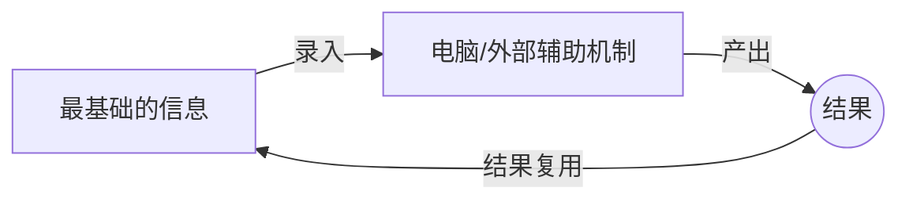
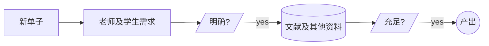
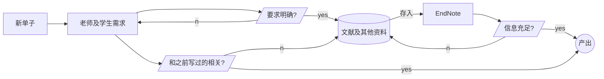

Hi，这篇是为了帮助大家形成一个工作流程。

### 关于工具的使用

我一向认为，人脑不是该用来记东西的，或者说，人脑就不该用在锻炼记忆力上。我们都是聪明人，聪明人的大脑是用来想事情的。

也就是说，把所有能够有现成的工具可以使用的流程，全都交给电脑或者其他的外部机制去完成。我们只需要做一些最基础的输入就好。就像这样：

举个例子，最开始我们写单子，是这样的：

我现在是：

这样就完成了资源的复用过程。

资源复用是一个很宽泛的概念，但我们只要用我们需要的就好了。拿来主义，香！

- [ ] 关于 EndNote 的使用以及如何快速用上我们需要的功能，我们之后专门找个时间，大家看下啥时候比较好，我基本都可以。所以拜托大家看看啥时候有空。对了对了，拜托大家发我一下注册 EndNote 的邮箱地址~
- [ ] 另外，马上要汇报 4 月份的目标工作量了，大家可以自由报一下。拜托光梅给我一下群主权限，我们直接用个 Excel 表格做一个数据整理就成。于是在这里就要说到第二个点。

### 工作管理

工作是结果导向。我之前订单少的时候统计自己的订单总是很麻烦，后来慢慢迭代出一个方法论。

1. 给每个订单定ID，从 1 开始。
2. 在后台给订单加上 ID 为内容的 tag（颜色自选）。
3. 把 ID 和单号整理在一个表格中，我用的是 obsidian，大家可以用 Excel。其中包含了 ID，单号，Workload，Finish Time，Finish Week（格式为 MM.DD-MM.DD，比如这周是03.29-04.04）。
4. 这样的好处是，填周报和算自己的工资很方便。填周报时，复制粘贴。算自己工资，用个 SUM函数算一下总工作量，按公式算一下就好。另外，可以有效防止传错订单。
5. 另外，下载了压缩包之后，解压有个文件夹，直接把文件夹改成 ID。这样子就省去了记单号的麻烦。
6. 于是回到上面那节的第二个待办。我的想法是，弄一个 Excel 表格，直接放在钉钉群。Excel 不是有分页吗，我们每个人一页就好了。这样子到时候不管是报工作量还是修改订单，都很方便。

### 结语

1. 想写多少写多少。一周写完能有组周奖金就有，没有就没有。个人生活更重要，工作只是……工作而已。
2. 一切重复性工作和记忆功能，让外部辅助代做，不然压力太大了。
3. 我看看有没有什么共享网盘，写完单子按照 checklist 检查一遍自己觉得差不多没问题之后直接传网盘，然后@我一下就好。我在想有没有什么网盘收到文件之后会自动推送的，那样@我也可以免了~
4. 啊反正有啥想说的就说~